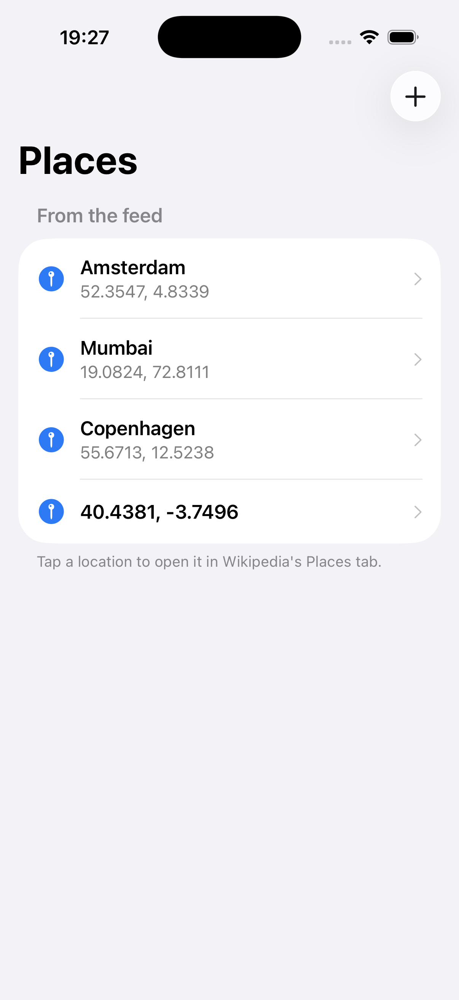
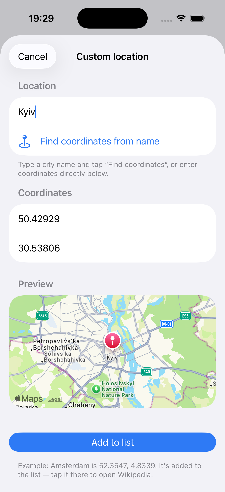
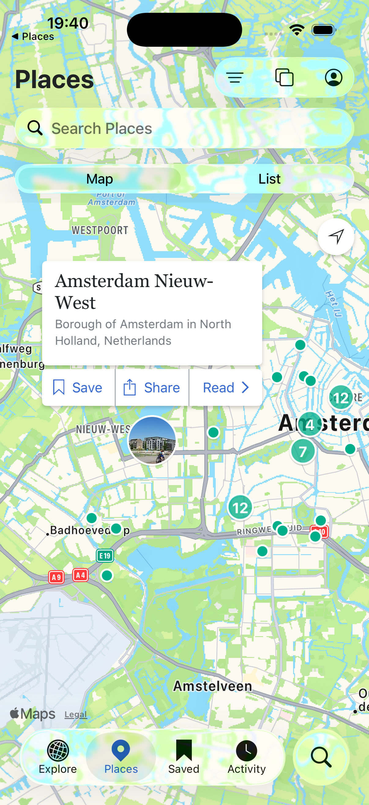

# Wikipedia Places — iOS Assignment

Author: **Max Mashkov**

This repository contains two things:

| Folder | What it is |
| ------ | ---------- |
| [`PlacesApp/`](PlacesApp) | A small **SwiftUI** test app that lists locations and opens them in Wikipedia. |
| [`wikipedia-ios/`](wikipedia-ios) | A local copy of the official [wikimedia/wikipedia-ios](https://github.com/wikimedia/wikipedia-ios) app, **modified** so it can be deep-linked straight to the *Places* tab centered on a given coordinate. |

The two apps talk to each other over a custom URL scheme (`wikipedia://`).

**Built with** Xcode 26 / iOS 26 SDK; PlacesApp targets iOS 26+ and uses Swift
Concurrency, the Observation framework, and MapKit's `MKGeocodingRequest`.

---

## The feature

Out of the box the Wikipedia app can be opened on its Places tab via
`wikipedia://places` and, optionally, centered on an **article**
(`wikipedia://places?WMFArticleURL=…`).

This assignment adds the ability to open Places centered on an **arbitrary
coordinate** supplied by the calling app:

```
wikipedia://places?lat=<latitude>&lon=<longitude>&title=<optional name>
```

Example:

```
wikipedia://places?lat=52.3547498&lon=4.8339215&title=Amsterdam
```

Opening that URL launches Wikipedia, switches to the Places tab, and centers the
map on Amsterdam (loading the top articles around it) instead of the user's
current location.

---

## Screenshots

| PlacesApp list | Custom location + map preview | Wikipedia opened at the coordinate |
| :---: | :---: | :---: |
|  |  |  |

The third screenshot is the modified Wikipedia app after firing
`wikipedia://places?lat=52.3547498&lon=4.8339215&title=Amsterdam` — it lands on the
**Places** tab centered on **Amsterdam** with nearby articles, not the user's location.

---

## Part 1 — PlacesApp (SwiftUI)

A minimal app that demonstrates the feature.

- Fetches locations from
  `https://raw.githubusercontent.com/abnamrocoesd/assignment-ios/main/locations.json`
  using `async`/`await`.
- Shows them in a `List`. Some feed entries have **no name** — those fall back to
  showing their coordinates.
- **Tapping a location** opens the Wikipedia app at that coordinate.
- The **＋** button lets the user **add a custom location** (name optional,
  latitude/longitude validated). It can also **look up a city name** and fill in
  the coordinates automatically via MapKit geocoding (`MKGeocodingRequest`). The
  added place appears at the top of the list under "Your locations", and the user
  taps it there to open Wikipedia — the same interaction as any feed location.
- Pull-to-refresh, loading/error states with retry, and a clear alert if the
  Wikipedia app isn't installed.

### Architecture

MVVM, kept deliberately small and testable:

```
PlacesApp/
  Models/          Location, LocationsResponse (Codable, lat/long → latitude/longitude)
  Networking/      LocationsServing protocol + LocationsService (async URLSession)
  Deeplink/        WikipediaDeepLink (pure URL builder) + URLOpening abstraction
  Geocoding/       Geocoding protocol + MapKitGeocoderService (city name → coordinate)
  ViewModels/      LocationsViewModel (@Observable, @MainActor)
  Views/           LocationsListView, CustomLocationView
```

- **Swift Concurrency:** networking is `async`/`await`; loading is a structured
  child of SwiftUI's `.task`, so cancellation propagates. The view model is
  `@MainActor` and uses the Observation framework (`@Observable`). Models are
  `Sendable`.
- **Accessibility:** each row is a single combined VoiceOver element with a label
  and an action hint; controls have explicit labels; Dynamic Type is respected.
- **Testability:** both the network (`LocationsServing`) and URL opening
  (`URLOpening`) are protocols, so the view model is tested with mocks — no
  network or `UIApplication` needed.

### Running it

```bash
open PlacesApp/PlacesApp.xcodeproj
```

Then run the **PlacesApp** scheme on an iOS 26+ simulator. No extra tooling is
required — the `.xcodeproj` is committed and self-contained.

### Tests

**43 tests across 6 suites**, written with the **Swift Testing** framework
(`@Test` / `#expect`):

```bash
cd PlacesApp
xcodebuild -scheme PlacesApp -project PlacesApp.xcodeproj \
  -destination 'platform=iOS Simulator,name=iPhone 17 Pro' test
```

Covered:
- **Model** — JSON decoding incl. the entry **without a name**, `lat`/`long` key
  mapping, `displayName`/coordinate formatting, Codable round-trip.
- **Networking** — real `LocationsService` against a stubbed `URLSession`
  (`URLProtocol`): valid decode, non-2xx status, malformed JSON, transport error.
- **Deep link** — `WikipediaDeepLink` URL construction (scheme/host, query items,
  title encoding, locale-independent decimals).
- **View models** — feed loading (success/failure), open behavior, add-to-list +
  de-duplication, coordinate validation, and MapKit geocoding — all with mocks, so
  no network or `UIApplication` is touched.

The Wikipedia-side change is also covered by unit tests — see Part 2.

---

## Part 2 — Wikipedia app changes

The change follows the app's existing deep-link pipeline
(`NSUserActivity` → `WMFAppViewController` → `PlacesViewController`). Four files:

1. **`Wikipedia/Code/NSUserActivity+WMFExtensions.m`** — `wmf_placesActivityWithURL:`
   now also parses `lat`, `lon`, and optional `title` query items and, when a valid
   coordinate is present, stashes them in the activity's `userInfo`
   (`WMFLatitude` / `WMFLongitude` / `WMFLocationName`). Parsing uses an
   `en_US_POSIX` number formatter so `.`-separated decimals are always accepted.

2. **`Wikipedia/Code/WMFAppViewController.swift`** — the `.places` case of
   `processUserActivity` reads that coordinate and, when present, calls the new
   `PlacesViewController.showLocation(withLatitude:longitude:name:)` instead of the
   article-based path.

3. **`Wikipedia/Code/PlacesViewController.swift`** — new
   `showLocation(withLatitude:longitude:name:)`. It builds a 10 km region around the
   coordinate, sets the map region, and runs a location search there. It also sets
   `panMapToNextLocationUpdate = false` so the first Core Location update does **not**
   snap the map back to the user's location. This mirrors the existing
   `zoomAndPanMapView(toLocation:)` + `performDefaultSearch(withRegion:)` behavior.

4. **`docs/url_schemes.md`** — documents the new coordinate deep link.

The change is unit-tested in the app's own test target:
**`WikipediaUnitTests/Code/NSUserActivity+WMFExtensionsTest.m`** adds cases for the
`lat`/`lon`/`title` parsing (valid, negative, no-title, incomplete-coords-ignored).

```bash
cd wikipedia-ios && scripts/setup_bundle_id ci
xcodebuild test -scheme Wikipedia -project Wikipedia.xcodeproj \
  -destination 'id=<booted-sim-udid>' -only-testing:WikipediaUnitTests/NSUserActivity_WMFExtensions_wmf_activityForWikipediaScheme_Test \
  CODE_SIGNING_ALLOWED=NO
```

### Building & running Wikipedia

One-time signing config (safe defaults, no prompt), then build:

```bash
cd wikipedia-ios && scripts/setup_bundle_id ci
```

To just **compile**, `CODE_SIGNING_ALLOWED=NO` is fine. To actually **run** it, the
app needs its app-group entitlement applied or it crashes on launch in
`MWKDataStore` (the shared container resolves to `nil`). Ad-hoc signing is enough
on the simulator:

```bash
xcodebuild -scheme Wikipedia -project Wikipedia.xcodeproj \
  -destination 'id=<booted-sim-udid>' \
  CODE_SIGN_IDENTITY="-" CODE_SIGNING_REQUIRED=NO CODE_SIGNING_ALLOWED=YES build
```

Then install the built `.app`, launch it, skip onboarding, and fire the deep link:

```bash
xcrun simctl openurl booted "wikipedia://places?lat=52.3547498&lon=4.8339215&title=Amsterdam"
```

(From SpringBoard/`simctl`, iOS shows a one-time "Open in Wikipedia?" prompt — tap
**Open**. The result is the third screenshot above.)

---

## Assignment requirements

- [x] Clone the Wikipedia app and modify it so it can be deep-linked to the Places
      tab at a given coordinate (`wikipedia://places?lat=..&lon=..`)
- [x] Test app fetches locations from the JSON feed
- [x] Tapping a location calls Wikipedia the new way
- [x] User can enter/add a custom location and open Wikipedia there
- [x] SwiftUI for the Places app
- [x] ReadMe
- [x] Unit tests (43 Places + 10 Wikipedia)
- [x] Bonus — Swift Concurrency & Accessibility
- [x] Worked locally with git; shared as a public GitHub repo

---

## Notes

- The assignment brief lists the feed URL under the `assignmentios` repo, but the
  file is actually served from **`assignment-ios`** (with a hyphen) — that is the URL
  the app uses.
- `wikipedia-ios/` is a vendored copy of the upstream app at clone time; the
  deep-link feature is the only functional change. Upstream lives at
  <https://github.com/wikimedia/wikipedia-ios>.
